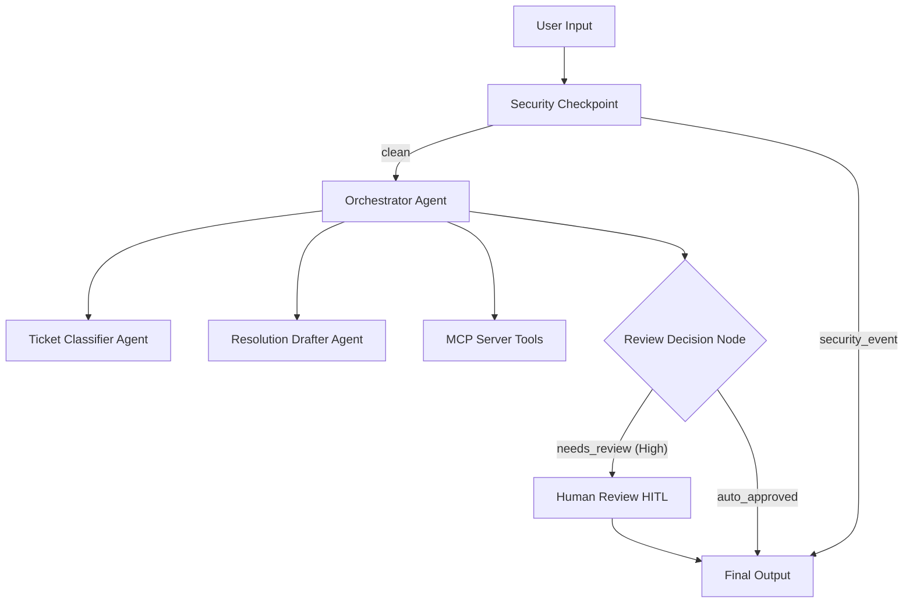
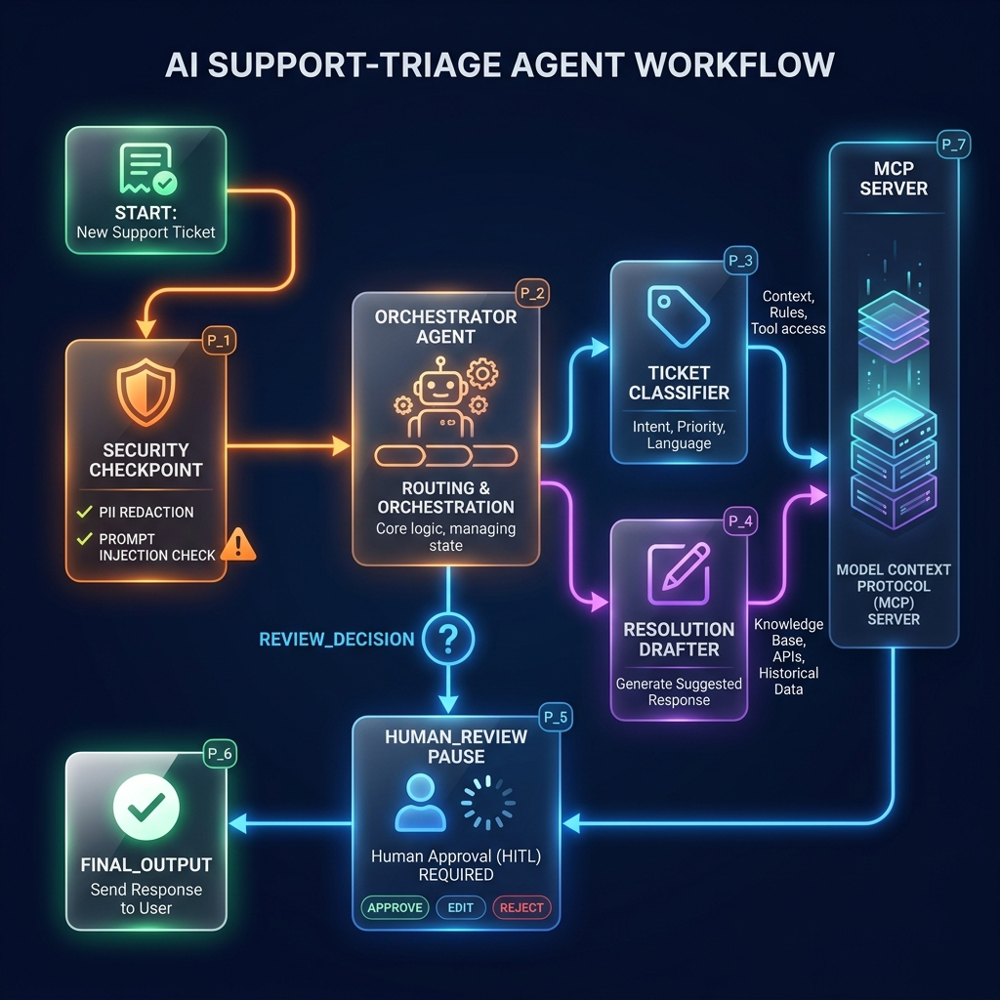
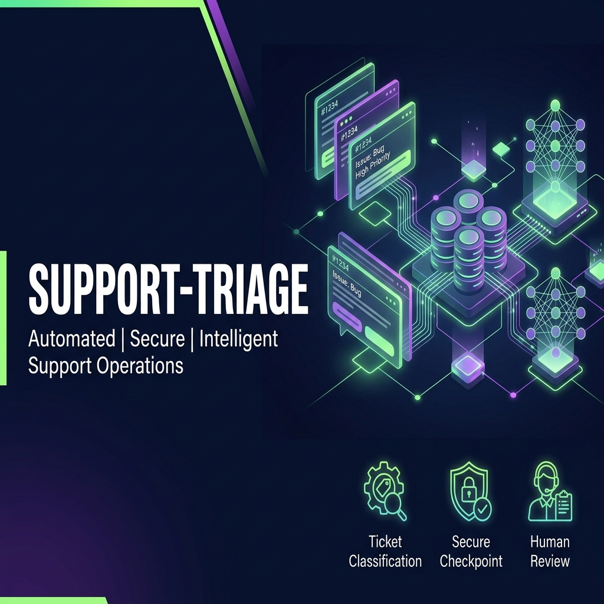

# support-triage

Automated customer support ticket classification, knowledgebase search, and resolution drafting built on the Google ADK framework.

## Prerequisites

- **Python**: Version 3.11 to 3.14.
- **uv**: Package manager (installed via `uv` or `uvx`).
- **Gemini API Key**: Obtain a key from [Google AI Studio](https://aistudio.google.com/apikey).

## Quick Start

```bash
git clone <repo-url>
cd support-triage
cp .env.example .env   # Add your GOOGLE_API_KEY
make install
make playground        # Opens UI at http://localhost:18081
```

## Architecture

The architecture consists of a multi-agent workflow coordinated by an orchestrator. It checks input security, classifies the ticket, uses MCP tools for lookup, and routes high-priority tickets for human-in-the-loop (HITL) approval.



## How to Run

- **Interactive UI Testing**:
  ```bash
  make playground
  ```
  This launches the playground server at [http://localhost:18081](http://localhost:18081).
  
- **Production Server Mode**:
  ```bash
  make run
  ```

## Sample Test Cases

### Test Case 1: Billing Refund Request (Auto-Approved)
- **Input**:
  ```
  Hi, I would like to request a refund for my last invoice. My customer ID is CUST-1002. Thank you.
  ```
- **Expected Flow**: `security_checkpoint` (clean) → `orchestrator` → `ticket_classifier` (Billing, Medium) → `resolution_drafter` (uses MCP to check billing info) → `review_decision` (auto-approved) → `final_output`.
- **Check**: Playground UI shows "Auto-Approved" with a draft response summarizing CUST-1002 billing status.

### Test Case 2: Technical Service Outage (Requires Human Review)
- **Input**:
  ```
  Our production database server seems to be completely down! We cannot connect to it, error 500.
  ```
- **Expected Flow**: `security_checkpoint` (clean) → `orchestrator` → `ticket_classifier` (Technical, High) → `resolution_drafter` → `review_decision` (needs_review) → `human_review` (pauses for approval) → `final_output`.
- **Check**: UI pauses and displays a human-in-the-loop review prompt requesting approval.

### Test Case 3: PII Blocked Request (Security Violation)
- **Input**:
  ```
  Hello, my Social Security Number is 000-12-3456. Please update my file.
  ```
- **Expected Flow**: `security_checkpoint` (security_event) → `final_output`.
- **Check**: Request is immediately blocked with "Security Checkpoint Blocked Request: PII detected (SSN or Credit Card number)".

## Troubleshooting

1. **Uvicorn or Python fails with 404 (Model Not Found)**:
   - Make sure your `.env` contains `GEMINI_MODEL=gemini-2.5-flash` (or another active model) and not the retired `gemini-1.5-*` models.
2. **Port 18081 Already in Use (Windows)**:
   - Terminate the old process using PowerShell:
     ```powershell
     Get-Process -Id (Get-NetTCPConnection -LocalPort 18081, 8090 -ErrorAction SilentlyContinue).OwningProcess | Stop-Process -Force
     ```
3. **Changes in agent.py not reflecting**:
   - Hot-reload is disabled on Windows for processes involving subprocesses like MCP. Stop and restart the playground server to load changes.

## Push to GitHub

1. Create a new repo at https://github.com/new
   - Name: `support-triage`
   - Visibility: Public or Private
   - Do NOT initialize with README (you already have one)

2. In your terminal, navigate into your project folder:
   ```bash
   cd support-triage
   git init
   git add .
   git commit -m "Initial commit: support-triage ADK agent"
   git branch -M main
   git remote add origin https://github.com/<your-username>/support-triage.git
   git push -u origin main
   ```

3. Verify .gitignore includes:
   ```
   .env          ← your API key — must NEVER be pushed
   .venv/
   __pycache__/
   *.pyc
   .adk/
   ```

⚠️ NEVER push `.env` to GitHub. Your API key will be exposed publicly.

## Assets

- **Workflow Diagram**: 
- **Cover Banner**: 

## Demo Script

The spoken narration script for project presentation is available at [DEMO_SCRIPT.txt](DEMO_SCRIPT.txt).
