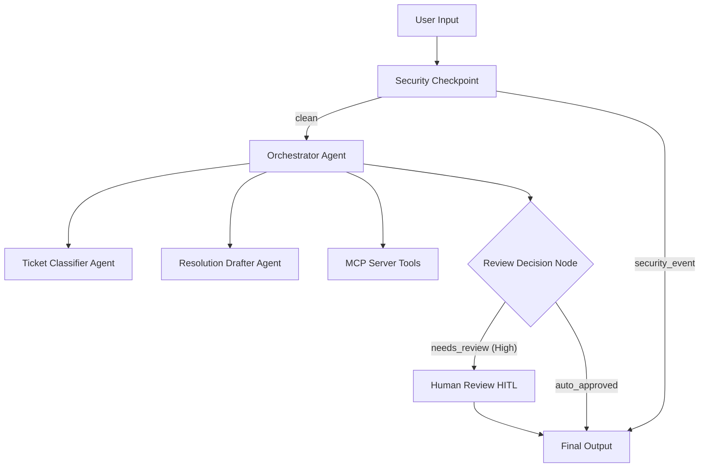

# Submission Write-Up: Support Triage Agent

## Problem Statement
In customer support departments, support engineers and agents are often overwhelmed by the volume of inbound tickets. Triaging these tickets, checking customer account records, referencing troubleshooting articles, and drafting responses is time-consuming and error-prone. This project automates the classification, database lookup, and initial draft resolution generation, allowing human agents to focus on validation, approval, and high-impact problem-solving.

## Solution Architecture
The architecture comprises a multi-agent workflow integrated with an MCP server and security gateway:

## Concepts Used

1. **ADK Workflow (Graph-based API)**: Defined in [app/agent.py](file:///d:/AI%20AGENTS/adk-workspace/support-triage/app/agent.py#L125-L137) using `Workflow`, mapping nodes and edges with route conditions.
2. **LlmAgent**: Used for specialized sub-agents `ticket_classifier` and `resolution_drafter`, and the main `orchestrator` in [app/agent.py](file:///d:/AI%20AGENTS/adk-workspace/support-triage/app/agent.py#L32-L73).
3. **AgentTool**: Configured in [app/agent.py](file:///d:/AI%20AGENTS/adk-workspace/support-triage/app/agent.py#L86) to enable the orchestrator to delegate classification and drafting to sub-agents.
4. **MCP Server**: Implemented using the MCP Python SDK in [app/mcp_server.py](file:///d:/AI%20AGENTS/adk-workspace/support-triage/app/mcp_server.py) to provide local system status, billing lookups, and knowledgebase search.
5. **Security Checkpoint**: A workflow function node in [app/agent.py](file:///d:/AI%20AGENTS/adk-workspace/support-triage/app/agent.py#L90-L137) that scrubs PII, blocks prompt injections, and logs audit events.
6. **Agents CLI**: Project scaffolded with `agents-cli scaffold create` and configured with pinned ranges in [pyproject.toml](file:///d:/AI%20AGENTS/adk-workspace/support-triage/pyproject.toml).

## Security Design
- **PII Scrubbing**: Regex filters automatically identify and redact Social Security Numbers (SSNs) and credit card numbers from the ticket text, protecting privacy before processing.
- **Prompt Injection Prevention**: Explicit keyword validation blocks inputs attempting to override the agent instructions (e.g. "ignore previous instructions").
- **Credential Protection**: Domain-specific rule flags and blocks tickets containing raw passwords or secret keys.
- **Audit Logging**: Emits JSON log events to `stdout` with precise severity tags (`INFO`, `WARNING`, `CRITICAL`), providing a robust audit trail for monitoring.

## MCP Server Design
- **`search_knowledge_base`**: Searches simulated support documentation for troubleshooting login issues, outages, and billing policies.
- **`get_customer_billing_info`**: Looks up billing accounts, plan status, and payment methods to resolve payment-related questions.
- **`get_system_status`**: Provides system uptime metrics to verify if technical issues match a known active incident.

## Human-in-the-Loop (HITL) Flow
To maintain quality control, the workflow uses a `review_decision` node to evaluate the ticket's priority. High-priority tickets (e.g. technical system outages or critical billing problems) are routed to the `human_review` node, which yields a `RequestInput` event to pause execution and prompt a human reviewer to approve or reject the draft response before it is finalized.

## Demo Walkthrough
1. **Billing Refund Request (Auto-Approved)**: Shows how a customer inquiry is classified as `Billing` (Medium priority), triggers the MCP billing lookup, drafts a response, and auto-approves it.
2. **Technical Service Outage (Requires Human Review)**: Shows how a critical server down message is classified as `Technical` (High priority) and triggers the HITL review gate, prompting for human verification.
3. **PII Blocked Request (Security Block)**: Shows how a request containing an SSN is scrubbed and how a request attempting prompt injection is immediately blocked.

## Impact / Value Statement
This support agent reduces resolution times from hours to seconds for common issues (billing info, logins, system status checks) while preserving security standards and quality control through the security checkpoint and human-in-the-loop validation for high-severity issues.
